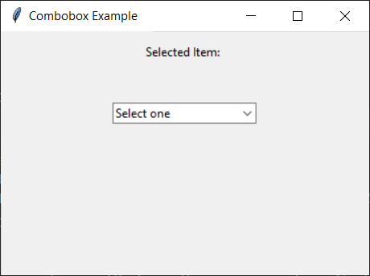
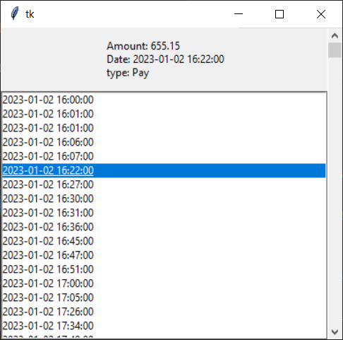
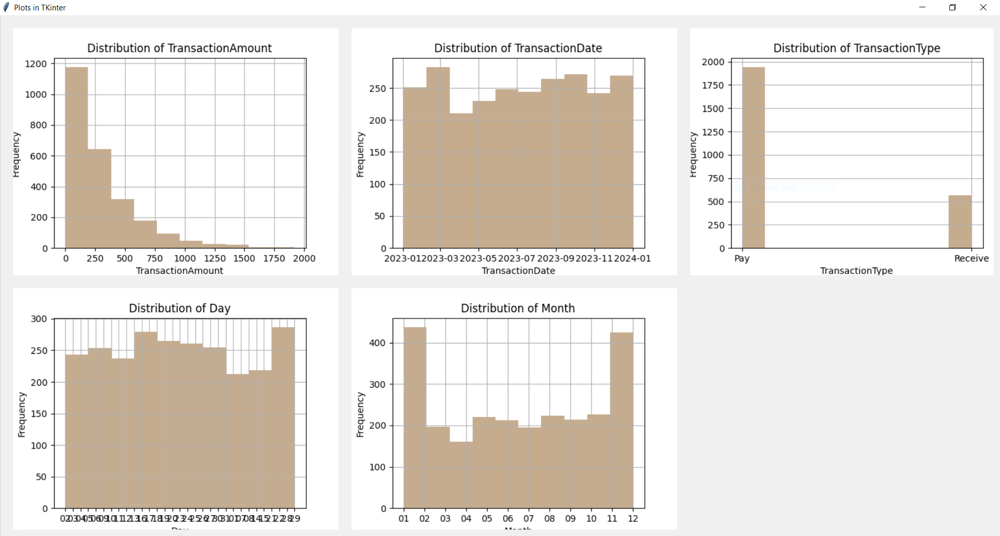

# Data Analysis
A bank data analysis project using a CSV file. Data is cleaned, normalized, and a data analysis chart is drawn.
you can check maximum pay and recive in data and see the monethly chart just a click. and choose a date time and see transactions in that date & time and after all checking diffrent information plots

# My-resume
click on link below to check my resume

https://rosebp85.github.io/resume/
